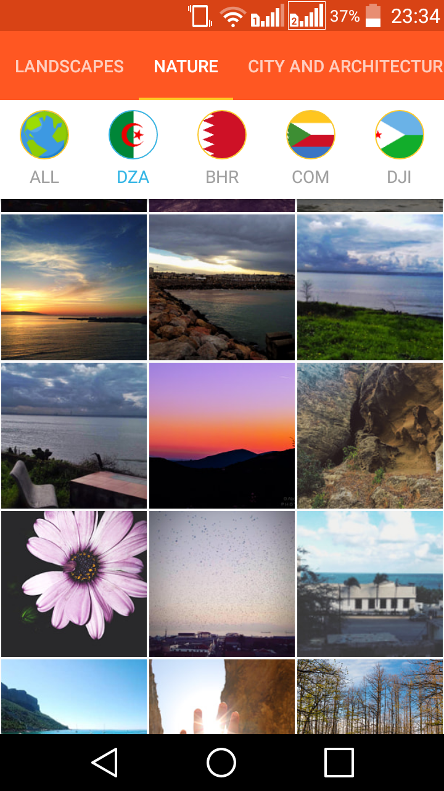
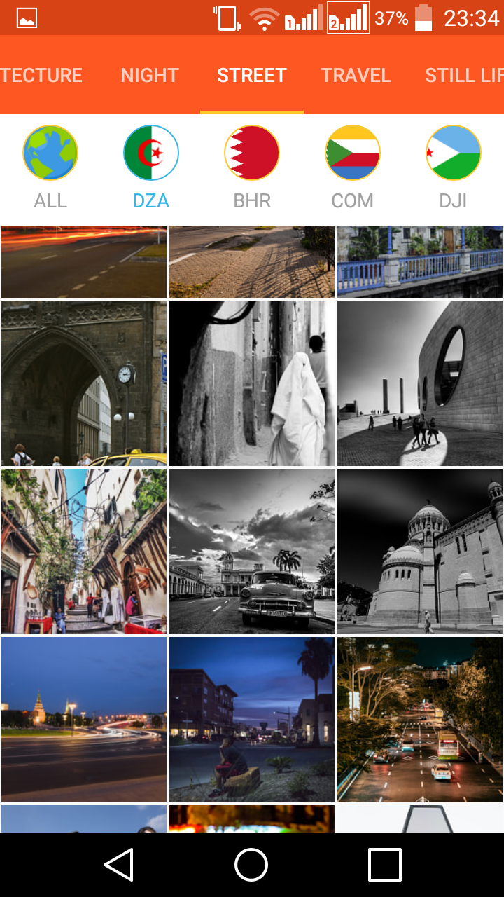
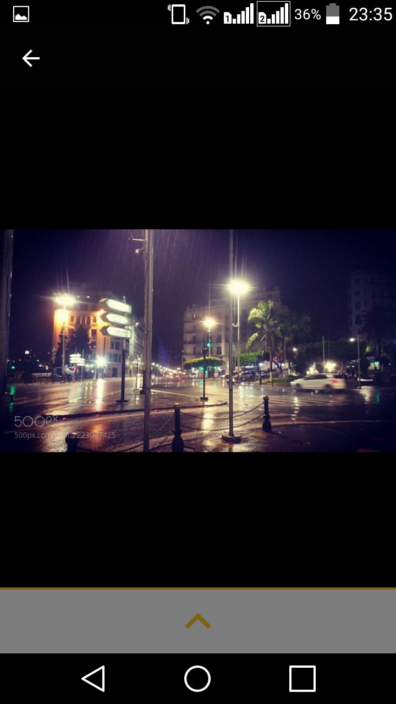

# DasBild
android app : arabic countries high quality image gallery based on 500px website photos api
# Concepts covered in this project
  - Fragments Communication
  - Web request with OKhttp library to RESTcountries Api and 500px photos API
  - infinite recyclerView scrolling 
  - using loaders
# Demo

  
  
  
  
  
  
   
  

